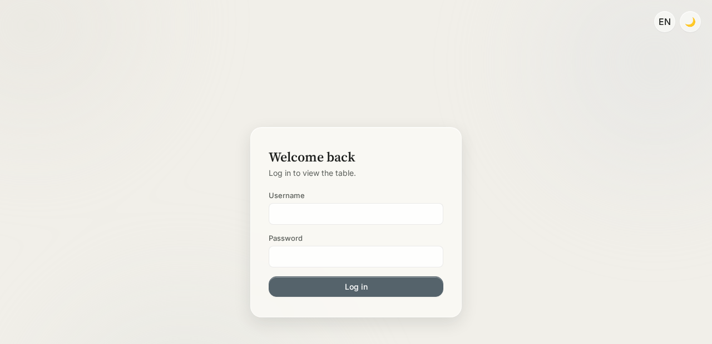
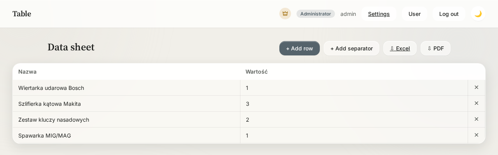
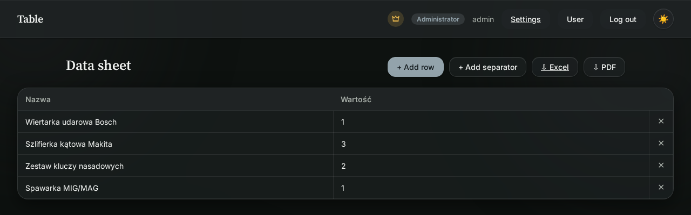
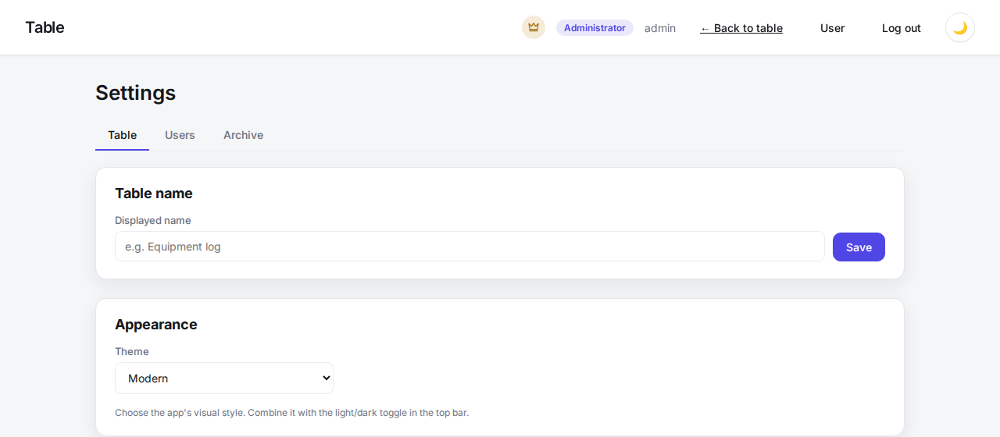
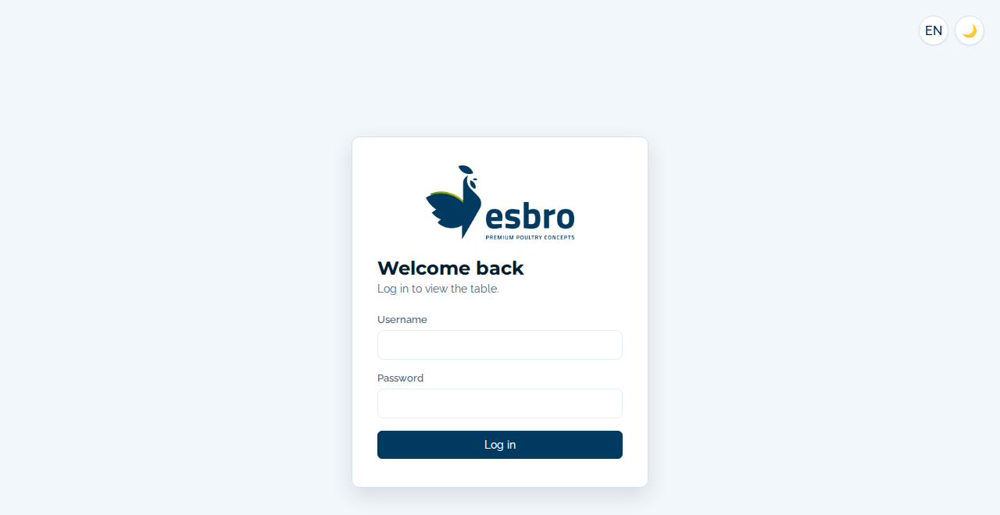

# Tabela — Table App with Login and Roles (PHP + Apache + MySQL)

A pure LAMP stack — **no Node.js, no npm, no build step**. Just copy the files
into a directory served by Apache and you're done.

A web app that displays an editable table (spreadsheet), with login
and three user roles:

- **Admin** — manages table columns (text / number / dropdown with defined options)
  and users (logins, passwords, roles).
- **Editor** — can add rows and edit cell values, but has no access
  to settings (columns, users).
- **Viewer** — sees the table in read-only mode, with no ability to make changes.

All permissions are enforced server-side (in PHP), not just hidden in the UI.

## Screenshots

| Login | Data sheet |
| --- | --- |
|  |  |

| Dark mode | Settings — Appearance |
| --- | --- |
|  |  |

The **Esbro** theme (see below) applies the company's own branding, logo and colors:



## Features

- **Themes** — three selectable visual styles (Settings → Appearance →
  Theme), each with a light and dark variant: **Liquid** (glassmorphism,
  the default), **Modern** (flat, no blur) and **Esbro** (the company's own
  brand palette, typography and logo). The theme choice and the light/dark
  toggle in the top bar are independent and combine freely.
- **Dark mode** — toggle in the top bar, remembered per browser (`localStorage`).
- **Multi-language UI** — English, Polish and Dutch, switchable per user in the
  "User settings" panel.
- **Public read-only sharing** — an admin can turn on "Public view" in Settings
  so `index.html` can be opened by anyone with the link, without logging in
  (still fully read-only; editing still requires login).
- **Daily archives** — a snapshot of the table is saved automatically every day
  at 8:00 PM via a cron job (see [`cli/daily_archive.php`](#6-daily-archive-cron-job)).
  Admins can browse, preview and delete past snapshots from the Archive tab.
- **Row dividers** — editors/admins can insert a full-width horizontal
  separator row to group data, independent of the table columns.
- **Export** — download the table as CSV/Excel or as a print-ready PDF.

## Tech stack

- **Backend:** plain PHP (no frameworks, no Composer) — PDO for MySQL
- **Database:** MySQL / MariaDB (your existing instance)
- **Login sessions:** native PHP sessions (server-side files)
- **Passwords:** `password_hash()` / `password_verify()` (bcrypt)
- **Frontend:** plain HTML/CSS/JS, no frameworks
- **Web server:** Apache with `mod_php` (or `php-fpm`, see below)

---

## 1. Server requirements

```bash
sudo apt update
sudo apt install apache2 php libapache2-mod-php php-mysql
```

Check that it's working:
```bash
php -v
apache2 -v
```

`php-mysql` is the PDO/mysqli extension — without it PHP can't connect to your database.

---

## 2. Setting up the MySQL database

```bash
sudo mysql -u root -p
```

```sql
CREATE DATABASE tabela_app CHARACTER SET utf8mb4 COLLATE utf8mb4_unicode_ci;
CREATE USER 'tabela_user'@'localhost' IDENTIFIED BY 'PUT-A-STRONG-PASSWORD-HERE';
GRANT ALL PRIVILEGES ON tabela_app.* TO 'tabela_user'@'localhost';
FLUSH PRIVILEGES;
EXIT;
```

The app creates the required tables (`users`, `columns`, `rows`, `cells`)
automatically on the first request — nothing to set up manually.

---

## 3. Uploading the files

```bash
cd /var/www/html
sudo git clone https://github.com/grubassound/tabela-app.git tabela-app
# (or copy the files another way, e.g. scp / rsync)

cd tabela-app
sudo cp config.php.example config.php
sudo nano config.php
```

In `config.php`, fill in your database credentials (same as in step 2):

```php
define('DB_HOST', 'localhost');
define('DB_PORT', '3306');
define('DB_NAME', 'tabela_app');
define('DB_USER', 'tabela_user');
define('DB_PASSWORD', 'PUT-A-STRONG-PASSWORD-HERE');
```

Set the file owner to the Apache user:
```bash
sudo chown -R www-data:www-data /var/www/html/tabela-app
```

---

## 4. Apache configuration

### a) Enable `.htaccess` support for the app directory

By default Apache **ignores `.htaccess` files**, and the ones in this project
block outside access to `config.php` and the `includes/` folder (where your
database credentials and connection logic live) — **this matters for security**,
so make sure to enable it.

Add this to `/etc/apache2/apache2.conf` (or to your VirtualHost config):

```apache
<Directory /var/www/html/tabela-app>
    AllowOverride All
    Require all granted
</Directory>
```

### b) Enable the PHP module (usually already enabled after installing `libapache2-mod-php`)

```bash
sudo a2enmod php8.3    # version number depends on your PHP install
sudo systemctl restart apache2
```

### c) If you want the app on its own site (VirtualHost)

Create `/etc/apache2/sites-available/tabela-app.conf`:

```apache
<VirtualHost *:80>
    ServerName tabela.yourdomain.com
    DocumentRoot /var/www/html/tabela-app

    <Directory /var/www/html/tabela-app>
        AllowOverride All
        Require all granted
    </Directory>

    ErrorLog ${APACHE_LOG_DIR}/tabela-app-error.log
    CustomLog ${APACHE_LOG_DIR}/tabela-app-access.log combined
</VirtualHost>
```

```bash
sudo a2ensite tabela-app.conf
sudo systemctl reload apache2
```

### d) If you just want IP-only access for now (no domain)

Nothing extra needed — as long as the files are in `/var/www/html/tabela-app`
and `AllowOverride All` is enabled as in step (a), the app is already reachable at:

```
http://YOUR-SERVER-IP/tabela-app/login.html
```

(Apache listens on port 80 by default, so no port is even needed in the URL.)

---

## 5. First run

Open `login.html` in your browser (e.g. `http://YOUR-IP/tabela-app/login.html`).

Default admin account (created automatically on the first request):
- **username:** `admin`
- **password:** `admin123`

⚠️ **Make sure to change this password right after your first login** — use the
"Change password" button in the top right corner once logged in.

---

## 6. Daily archive (cron job)

To have the app automatically save a daily snapshot of the table (at 8:00 PM),
add a cron job that runs the CLI script:

```bash
sudo crontab -e -u www-data
```

Add this line (adjust the path if you installed the app elsewhere):

```cron
0 20 * * * /usr/bin/php /var/www/html/tabela-app/cli/daily_archive.php >> /var/www/html/tabela-app/archive.log 2>&1
```

Snapshots are stored in the `archives` table and can be browsed, previewed or
deleted by an admin from the **Archive** tab in the admin panel.

---

## Project structure

```
tabela-app/
├── config.php.example    ← config template (copy as config.php)
├── .htaccess               ← blocks outside access to config.php
├── includes/
│   ├── .htaccess            ← blocks the WHOLE folder from outside access
│   ├── db.php                 ← PDO connection + table creation
│   ├── auth.php                ← helper functions (sessions, JSON, permissions)
│   ├── bootstrap.php            ← included at the top of every file in api/
│   └── snapshot.php              ← builds/saves the daily archive snapshot
├── api/
│   ├── login.php     (POST)
│   ├── logout.php    (POST)
│   ├── me.php         (GET, PUT — change password, language)
│   ├── table.php       (GET — respects "public view" setting)
│   ├── rows.php         (POST, DELETE ?id=)
│   ├── cells.php          (PUT)
│   ├── columns.php         (POST, PUT ?id=, DELETE ?id=)
│   ├── users.php            (GET, POST, PUT ?id=, DELETE ?id=)
│   ├── settings.php          (GET, PUT — public view, table name)
│   └── archives.php           (GET, DELETE ?id= — daily snapshots)
├── cli/
│   └── daily_archive.php      ← run via cron, see step 6
├── login.html
├── index.html          ← table view
├── admin.html            ← admin panel (users, columns, settings, archive)
├── css/style.css          ← Liquid / Modern / Esbro themes, light + dark
├── img/                     ← Esbro theme logo assets
├── screenshots/               ← images used in this README
└── js/{login,app,admin,theme,i18n}.js
```

## Security — things to keep in mind

- **`config.php` contains your database password** — never commit it to git
  (it's in `.gitignore`) and make sure `.htaccess` actually blocks access to it
  (see step 4a — without `AllowOverride All`, `.htaccess` does nothing).
- **Public view** exposes the table (read-only) to anyone with the link, with
  no login required — only turn it on for data that's fine to share openly.
- You'll want to add **HTTPS** eventually (Let's Encrypt / certbot), so login
  passwords don't travel over the network in plain text:
  ```bash
  sudo apt install certbot python3-certbot-apache
  sudo certbot --apache -d tabela.yourdomain.com
  ```
  After enabling HTTPS, set this in `config.php`:
  ```php
  define('SESSION_SECURE_COOKIE', true);
  ```

## Backing up your data

```bash
mysqldump -u tabela_user -p tabela_app > backup-tabela-app-$(date +%F).sql
```

## Possible extensions you can ask for

- Cell change history (who changed what, and when).
- Column sorting/filtering, CSV/Excel/PDF export.
- Drag-and-drop reordering of columns/rows.
- HTTPS and domain setup for your specific address.
